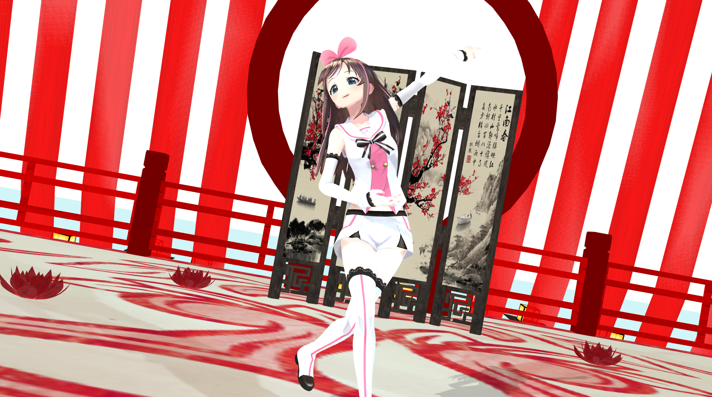

##  mmd-web-play-mmd播放器



演示地址：[http://pmx.fcup.top](http://pmx.fcup.top/)

模型越大，加载的时间会越长，显卡如果不行，也会造成卡顿

### 使用方法

先克隆此项目 到项目根目录执行

```
 npm install
```

 然后在执行

```
npm install webpack webpack-cli -g
```

接着开始编译

```
npm run build
```

nginx|apache绑定dist目录,然后访问即可

>我这里的node版本是16.14.0

>请不要使用低版本的node

### 更改配置
打开src/load.js修改这里，注意模型文件要放在model目录下
```
let modelFile = 'model/kizunaai/kizunaai.pmx'; //人物模型
let cameraFile = 'model/qsx/jt.vmd';// 镜头
let musicFile = 'model/qsx/qsx.mp3'; // 音乐
let motionFile = "model/qsx/dz.vmd"; // 动作
let stageFile = "model/gufengwutai/wt.pmx"; // 舞台
```

>每次更改后，需要重新打包

### 模型分享

[收集的一些模型，以供下载，演示](http://mmd.fcup.top)

### 使用须知

模型都会涉及到版权问题，请勿将没有商业版权或者进行二次修改的模型进行盈利

本人将不负任何责任，模型拥有者将有权进行追责
